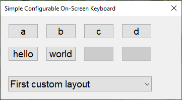

# ScreenKeyboard #

ScreenKeyboard is an extremely simplistic, grid-of-buttons style on-screen keyboard for Windows 7+. Users may define their own layouts in JSON files. The purpose of ScreenKeyboard is to provide quick access to a user-defined set of unicode characters.


## [Download](https://github.com/flinti/ScreenKeyboard/releases/download/v1.0/ScreenKeyboard.exe) and Installation ##

There is no installation required, just download the [ScreenKeyboard.exe](https://github.com/flinti/ScreenKeyboard/releases/download/v1.0/ScreenKeyboard.exe) file and start it.

This application was quickly written to ease writing phonetic transcriptions for the English language and to help writing Old and Middle English texts. However, due to its configurable nature, it may be of use to anyone who needs quick access to a set of unicode characters on Windows.

## How to use ##
Start the ScreenKeyboard.exe file to open the keyboard. The keyboard window remains in the background and keeps your writing application focused. Clicking a button will input the character(s) shown as the button's text into your focused application window. Pressing *Shift* while clicking will insert uppercase character(s), if defined in the layout.

To select a different layout, choose one of the available layouts from the combo box at the bottom. Click into the window of your writing application to focus it, now you can type using the new layout.

ScreenKeyboard loads user-defined layout files (\*.json) from the `ScreenKeyboard` directory in the current users' `Documents` folder (usually `C:\Users\<user name>\Documents\ScreenKeyboard`). Create the ScreenKeyboard folder at that location and create  a .json file with your layout there.


## JSON format example ##
 - the layout file must be encoded in UTF-8
 - the `buttons` entry defines the buttons' text in the layout. The text will be send as input when the button is clicked. The buttons are defined from left to right, top to bottom. You may specify more than one unicode charaacter.
 - an empty string ("") will show a deactivated button
 - the `buttons_shift` entry is optional
   - the `buttons` and `buttons_shift` lists must have the same length, if `buttons_shift` is present
```js
{
  "display_name": "Old/Middle English (orthographic)",	// name shown in the combo box for layout selection
  "button_width": 40,	// width of the buttons
  "button_height": 30,	// height of the buttons
  "button_margin": 5,	// space between buttons
  "button_columns": 8,	// amount of columns in the layout
  "buttons": [
    "ð","þ","ċ","ġ","ſ","ƿ","ȝ","",
	"ā","æ","ǣ","ē","ī","ō","ū","ȳ",
	"⁊","ꝥ"
  ],
  "buttons_shift": [
    "Ð","Þ","Ċ","Ġ","","Ƿ","Ȝ","",
	"Ā","Æ","Ǣ","Ē","Ī","Ō","Ū","Ȳ",
	"","Ꝥ"
  ]
}
```

## Your first custom layout ##

Create a file `my_first_layout.json` (you may choose any name as long as it ends in `.json`) in `C:\Users\<your username>\Documents\ScreenKeyboard\`. Make sure it is encoded in UTF-8 (do not use the Windows default notepad, use a better text editor like Notepad++). Paste the following text into the file:

```js
{
  "display_name": "First custom layout",
  "button_width": 40,
  "button_height": 30,
  "button_margin": 5,
  "button_columns": 4,
  "buttons": [
    "a", "b", "c", "d", "hello", "world"
  ],
  "buttons_shift": [
    "A", "B", "C", "D", "HELLO", "WORLD"
  ]
}
```

(Re)start ScreenKeyboard.exe, select "First custom layout" from the combo box and have fun with your first custom layout!



## Known issues ##

 - font size is not scaled with selected interface scale (DPI)
 - ScreenKeyboard grabs focus after a different layout is selected

## License ##

This application is released under the GNU General Public License v3 or later. 

## Credits ##

ScreenKeyboard uses the json library github.com/nlohmann/json which is MIT licensed, see thirdparty/json.hpp, Copyright (c) 2013-2019 Niels Lohmann <http://nlohmann.me>.

